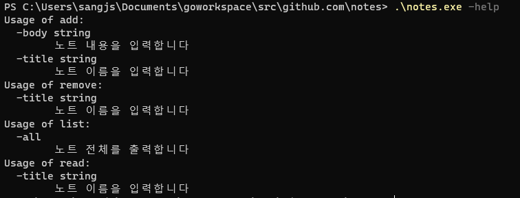
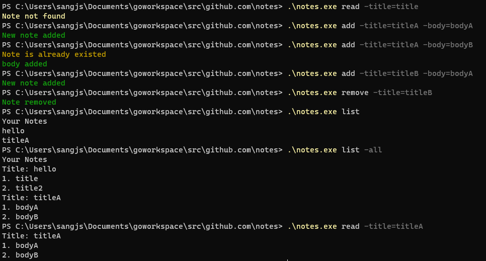
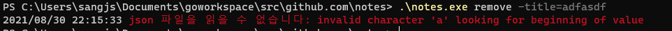

# notes-app



## 사용 예시

- json 파일에 노트 형식으로 저장한다



```json
[{"title":"hello","body":["title","title2"]},{"title":"titleA","body":["bodyA","bodyB"]}]
```

## 에러 상황

- json 파일을 읽을 수 없는 경우

  

## 사용 모듈 및 버전

- 버전: 1.16

- 주요 모듈: `flag`

- chalk 모듈 라이센스

  - https://github.com/ttacon/chalk
  
  - Copyright (c) 2014 Trey Tacon
  
  - The MIT License (MIT)
  
  - 변경 사항
  
    1. BrightColor 를 설정할 수 있다 
  
    ```go
    	// chalk/chalk.go line 19
    	BrightBlack   = BrightColor{Black}
    	BrightRed     = BrightColor{Red}
    	BrightGreen   = BrightColor{Green}
    	BrightYellow  = BrightColor{Yellow}
    	BrightBlue    = BrightColor{Blue}
    	BrightMagenta = BrightColor{Magenta}
    	BrightCyan    = BrightColor{Cyan}
    	BrightWhite   = BrightColor{White}
    ```
  
     2. Color 함수를 Color 클래스와 겹칠 우려가 있어 Set으로 변경하였다
  
    ```go
    func (c Color) Set(value string) string {
    	return fmt.Sprintf("%s%s%s", c, value, ResetColor)
        
    func (bc BrightColor) Set(value string) string {
    	return fmt.Sprintf("%s%s%s", bc, value, ResetColor)
    }
    ```
  
    

## Command Package

-  [golang flag package](https://pkg.go.dev/flag)

- FlagSet 생성 및 Flag 등록

  ```go
  // addCommand
  addCommand := flag.NewFlagSet("add", flag.ExitOnError)
  
  addCommand.StringVar(&addTitleFlag, "title", "", "노트 이름을 입력합니다")
  addCommand.StringVar(&addBodyFlag, "body", "", "노트 내용을 입력합니다")
  ```

- Flag Default 설정 프린트

  ```go
  addCommand.PrintDefaults()
  ```

- Command 화면으로 입력된 명령을 파싱하고 파싱하였는지 확인하기

  ```go
  addCommand.Parse(os.Args[2:])
  
  addCommand.Parsed()
  ```

## Notes Package

- Notes, Note 구조체

  ```go
  type Notes []Note
  
  type Note struct {
  	Title string   `json:"title"`
  	Body  []string `json:"body"`
  }
  ```

- ioutil 모듈

  - `os.IsNotExist`: 에러가 파일이 존재하지 않아 발생한다면 notes 구조체를 반환한다
  - `ioutil.ReadFile()`: 파일 이름으로 파일을 읽어오고 에러 발생시 `err=EOF`이다 
  - `ioutil.WriteFile()`:  파일 이름으로 파일을 작성한다 파일이 존재하지 않으면 파일을 생성한다

  ```go
  // loadNotes()
  	file, err := ioutil.ReadFile("notes.json")
  	if err != nil {
  		if os.IsNotExist(err) {
  			return notes
  		} else {
  			panic(handleerror.MakeErr("json 파일을 읽을 수 없습니다", err))
  		}
  	}
  // saveNotes()
  	err = ioutil.WriteFile("notes.json", bytes, 0755)
  	if err != nil {
  		panic(handleerror.MakeErr("json 파일에 작성할 수 없습니다", err))
  	}
  ```

- json 모듈

  - `json.Marshal(v interface{})`: v의 JSON encodeing을 반환합니다 

    Marshal은 v 값을 재귀적으로 순회한다. 값이 Marshaler 인터페이스를 구현하고 `nil` 포인터가 아닌 경우 Marshal은 MarshalJSON 메서드를 호출하여 JSON을 생성한다

  - `func Unmarshal(data []byte, v interface{}) error`: JSON 인코딩 데이터를 구문 분석하여 v 가 가리키는 값에 결과를 저장한다. v가 `nil`이거나 포인터가 아니라면 `Unmarshal`은 `InvalidUnmarshalError`을 반환한다

  ```go
  // saveNotes()
  bytes, err := json.Marshal(notes)
  	if err != nil {
  		panic(handleerror.MakeErr("json 파일로 변환할 수 없습니다", err))
  	}
  
  // loadNotes
  err = json.Unmarshal(file, &notes)
  	if err != nil {
  		panic(handleerror.MakeErr("json 파일을 읽을 수 없습니다", err))
  	}
  ```

  

